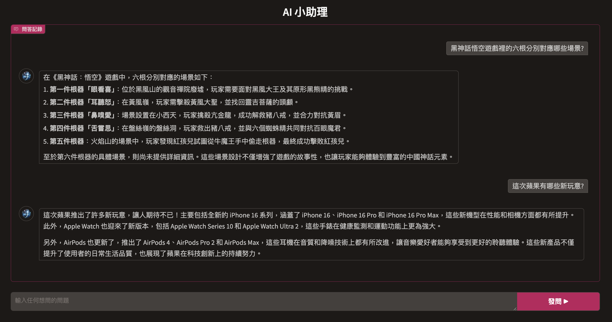

<p align="center"><h1>A digital doctor POC with RAG and LLM</h1></p>
<div width="100%">
    <span style="float:left;"></span>
    <span style="float:left;"></span>
</div>
<br/>

## Platform Support
- OS X 10.11 (x86_64)
- Other linux-like OS

## How to Build

### (1) Install requirements
```
pip3 install -r requirements.txt
```

### (2) Edit config.ini
```
mv ./config.ini.example ./config.ini
```
And then update "api_key" in content of config.ini


## How to Run
```
python3 ./ai-agent.py
```
It will deploy a service at: http://127.0.0.1:7860, just run it with your browser.<br/>
Or you can build it on Heroku, following below steps: <br/>

### (1) Build a random Heroku App
```
heroku login
heroku create
```
### (2) Push to Heroku
```
git init
git add -A
git commit -m "commit message here"
heroku git:remote -a Your-Heroku-Git-URL
git push heroku master
```
### (3) Open the Heroku App URL
Our example: <a href="https://ai-doctor-agent-756a5f6cc527.herokuapp.com/" target="_blank">https://ai-doctor-agent-756a5f6cc527.herokuapp.com/</a>
